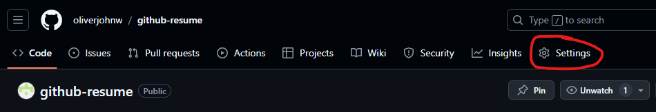
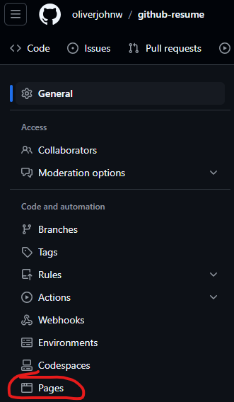

# How to Launch Git Resume

This document will run through the steps on how to launch the digital resume to Github Pages.

## Steps

The steps to launching your own Github resume are listed below:

1) Fork this repository

2) Fill out **README.md** to match your personal information and delete note at top.

3) Fill out **_config.yml** to match your name

4) Enter the "Settings" tab under the project repository on Github

 

5) Enter the "Pages" tab under the "Code and automation" section

 

6) Under the "Branch" section, change the branch to the *main* branch and click save.

