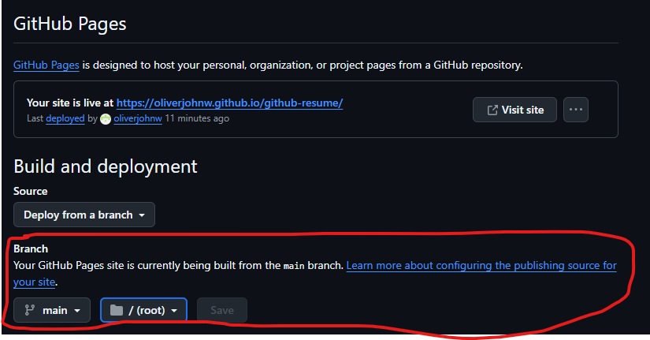
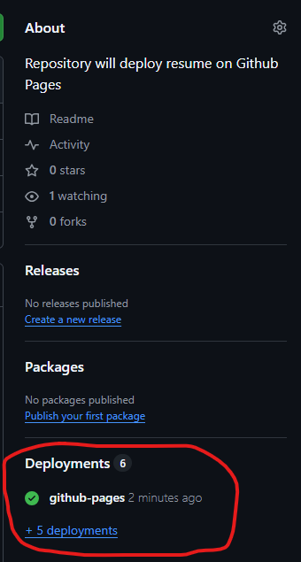

# Launching Your Github Resume

This document will run through the steps on how to launch the digital resume to Github Pages.

 

## Steps

The steps to launching your own Github resume are listed below:

 

1) Fork this repository

2) Fill out **README.md** to match your personal information and delete the note at the top of the file.

3) Fill out **_config.yml** to match your name.

4) Enter the "Settings" tab under the project repository on Github.

 

5) Enter the "Pages" tab under the "Code and automation" section

 

6) Under the "Branch" section, change the branch to the *main* branch and click save.

 

 

Congratulations, you've launched your own Github resume! 

It will be available to view at *your_github_username.github.io/your_repository*

## Tips

Here are some important tips and things to remember:

 

***Accessing Your Page***

If you forget what your page URL is, you can access it by clicking on the "Deployments" section on the main Github page. See below:

***Making Changes***

You may continously update your README.md to update your resume. Just make sure to push the changes to your Github. It may take a few moments for your page to render.

## Example

An example repository can be seen here: https://github.com/oliverjohnw/digital-cv. 

The launched resume can be viewed here: https://oliverjohnw.github.io/digital-cv/ 